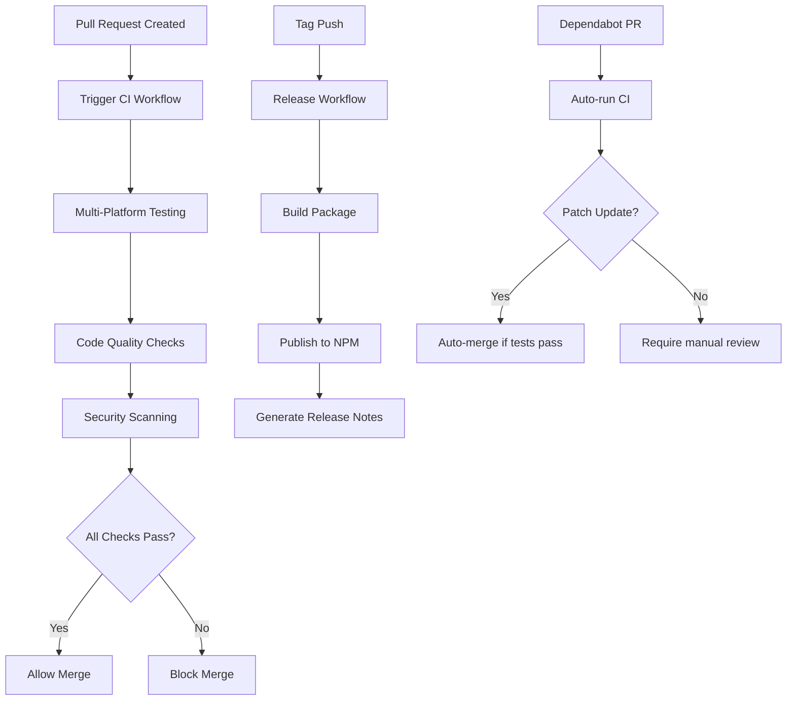

# Design Document

## Overview

This design establishes a comprehensive GitHub CI/CD pipeline for the decomment CLI tool project. The system will use GitHub Actions workflows to automate testing, code quality checks, security scanning, and deployment processes. Branch protection rules will enforce quality gates, and automated dependency management will keep the project secure and up-to-date.

## Architecture

### CI/CD Pipeline Flow



### Workflow Structure

1. **Main CI Workflow** (`ci.yml`)
   - Triggered on: push, pull_request
   - Multi-platform testing (Ubuntu, macOS, Windows)
   - Multiple Node.js versions (16.x, 18.x, 20.x)

2. **Release Workflow** (`release.yml`)
   - Triggered on: tag push
   - Automated NPM publishing
   - Release notes generation

3. **Security Workflow** (`security.yml`)
   - Dependency vulnerability scanning
   - Code security analysis

## Components and Interfaces

### GitHub Actions Workflows

#### Main CI Workflow
```yaml
# Location: .github/workflows/ci.yml
# Purpose: Run tests, linting, and quality checks
# Triggers: push, pull_request
# Matrix: Node.js versions × Operating systems
```

#### Release Workflow
```yaml
# Location: .github/workflows/release.yml
# Purpose: Automated package publishing
# Triggers: tag push (v*.*.*)
# Outputs: NPM package, GitHub release
```

#### Security Workflow
```yaml
# Location: .github/workflows/security.yml
# Purpose: Security and dependency scanning
# Triggers: schedule (weekly), pull_request
# Tools: npm audit, CodeQL, Dependabot
```

### Branch Protection Configuration

#### Main Branch Rules
- Require pull request reviews (1 reviewer minimum)
- Require status checks to pass:
  - `test (ubuntu-latest, 16.x)`
  - `test (ubuntu-latest, 18.x)`
  - `test (macos-latest, 16.x)`
  - `test (macos-latest, 18.x)`
  - `security-scan`
- Require branches to be up to date
- Restrict pushes to main branch

### Dependabot Configuration

#### Dependency Management
```yaml
# Location: .github/dependabot.yml
# Purpose: Automated dependency updates
# Schedule: Weekly for production dependencies
# Auto-merge: Patch updates only
```

## Data Models

### Workflow Status Data
```typescript
interface WorkflowStatus {
  name: string;           // Workflow name
  status: 'success' | 'failure' | 'pending';
  conclusion: string;     // Detailed result
  platform: string;      // OS platform
  nodeVersion: string;    // Node.js version
  timestamp: Date;        // Execution time
}
```

### Release Data
```typescript
interface ReleaseInfo {
  version: string;        // Package version
  tagName: string;        // Git tag
  releaseNotes: string;   // Generated notes
  npmPublished: boolean;  // NPM publish status
  artifacts: string[];    // Build artifacts
}
```

### Security Scan Results
```typescript
interface SecurityScan {
  vulnerabilities: {
    severity: 'low' | 'moderate' | 'high' | 'critical';
    package: string;
    version: string;
    recommendation: string;
  }[];
  codeQuality: {
    issues: number;
    coverage: number;
    maintainability: string;
  };
}
```

## Error Handling

### CI Workflow Failures
- **Test Failures**: Block merge, provide detailed logs
- **Build Failures**: Notify via GitHub status checks
- **Timeout Handling**: 10-minute timeout for test suites
- **Platform-Specific Issues**: Isolate failures by platform

### Release Workflow Failures
- **NPM Publish Failures**: Create GitHub issue with error details
- **Version Conflicts**: Skip publishing, log warning
- **Authentication Issues**: Fail workflow, require manual intervention

### Security Scan Failures
- **Critical Vulnerabilities**: Block PR merge
- **Moderate/High Issues**: Create warning status
- **False Positives**: Allow manual override with justification

### Dependabot Integration
- **Failed Updates**: Automatic retry after 24 hours
- **Conflicting Dependencies**: Manual review required
- **Breaking Changes**: Require maintainer approval

## Testing Strategy

### Multi-Platform Testing Matrix
```yaml
strategy:
  matrix:
    os: [ubuntu-latest, macos-latest, windows-latest]
    node-version: [16.x, 18.x, 20.x]
```

### Test Categories
1. **Unit Tests**: Jest test suite execution
2. **Integration Tests**: CLI command testing
3. **Platform Tests**: OS-specific functionality
4. **Performance Tests**: CLI execution speed benchmarks

### Code Coverage Requirements
- Minimum 80% code coverage
- Coverage reports uploaded to Codecov
- Coverage status displayed on PRs

### Quality Gates
1. All tests must pass
2. No linting errors
3. Security scan passes
4. Code coverage meets threshold
5. No critical vulnerabilities

## Security Considerations

### Secrets Management
- NPM_TOKEN: Stored in GitHub repository secrets
- CODECOV_TOKEN: For coverage reporting
- Principle of least privilege for workflow permissions

### Dependency Security
- Weekly Dependabot scans
- Automated security updates for patches
- Manual review for major version updates

### Code Security
- CodeQL analysis for JavaScript
- npm audit for dependency vulnerabilities
- SARIF upload for security findings

## Performance Optimization

### Workflow Efficiency
- Dependency caching using actions/cache
- Parallel job execution across platforms
- Early termination on first failure (fail-fast)

### Build Optimization
- Node.js setup with version caching
- npm ci for faster, reliable installs
- Artifact caching between workflow runs

## Monitoring and Observability

### Workflow Monitoring
- GitHub Actions dashboard for workflow status
- Email notifications for workflow failures
- Slack integration for team notifications (optional)

### Metrics Collection
- Build success/failure rates
- Test execution times
- Dependency update frequency
- Security scan results trends
